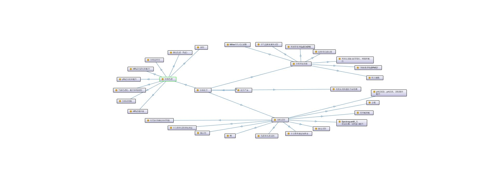
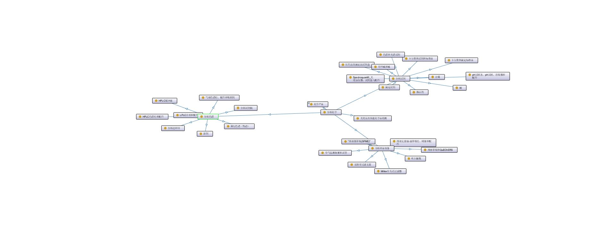
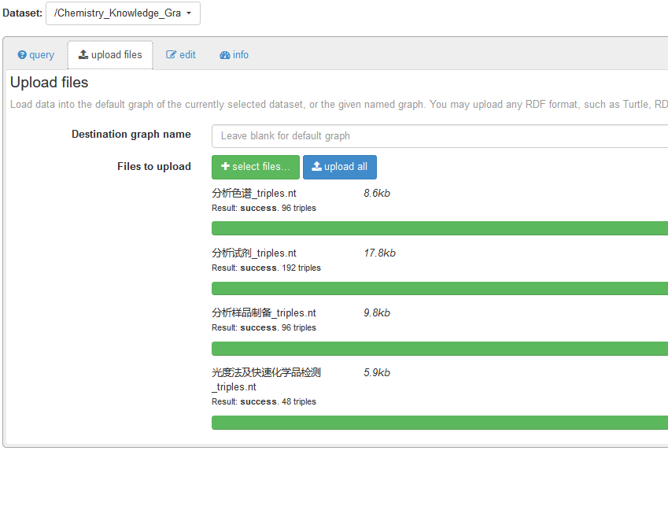
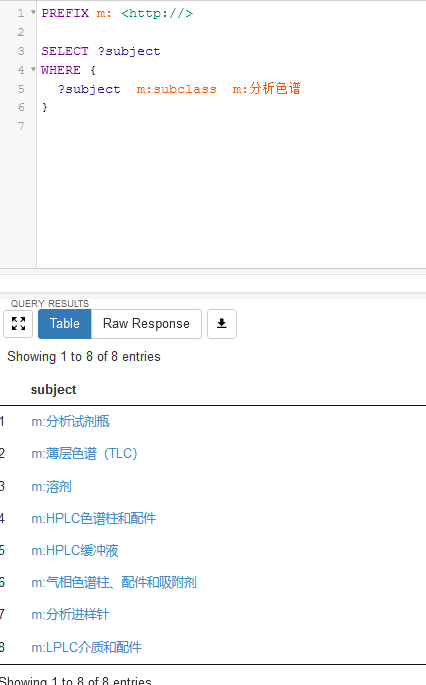

# ChemicalProductKnowledgeGraph

# 介绍

这个项目是化工产品的知识图谱，具体包括以下文件。目标网站是[MERCK](https://www.sigmaaldrich.cn/CN/zh/products/analytical-chemistry)

* [webData.py](https://github.com/KxuanZhang/ChemicalProductKnowledgeGraph/blob/main/webData.py) 爬虫
* nt格式的数据
* owl文件

# 效果

# 详细介绍

https://www.jianshu.com/p/d2f95fd2b2d9
